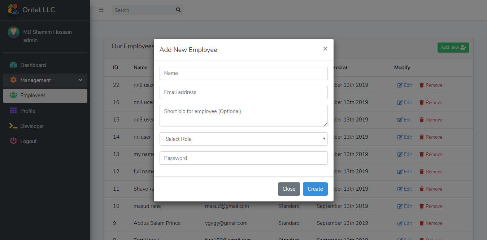

# orrletinc
### A single Page Application using Vue-router, Laravel & Axios

This is a single page application (SPA) of a company management system for its admin, manager, and the standard employees. 
Here admin can perform all kinds of CRUD (Create, Read, Update, & Delete) actions and the manager is responsible for handling 
the employee's tasks. So basically this is a simple dashboard, but the main important factor of this project is, it doesn't 
refresh the whole page for each request. The Vue-Router makes this webpage like a standalone application, which is obvious 
for a very large organization.

I used these functionalities and tools to complete this project,
* Vue-router and Axios (a lightweight promise-based asynchronous HTTP client service)
* AdminLTE 3 dashboard with vForm validation package
* Vue-filters and Vue-progress bar package
* moment.js for timing functions
* sweet-alert for prompts
* vue.js custom event handling features
* Postman app to debug and evaluate client requests
* Laravel Passport for securing data
* base64 & Intervention for image uploading and cropping
* ACL (Access Control List) in laravel - both frontend and backend

**User profile & settings**

**Admin panel for handling employees**

**Update user data without page refresh**

**Dialog using sweet-alert**

**Prompt dialog using sweet-alert**

Thank you very much! :smiley:
* **Name:** Shamim Hossain
* **Email:** hossains159@gmail.com
* **Facebook:** https://www.facebook.com/shamscorner
* **Linkedin:** https://www.linkedin.com/in/shamscorner/
